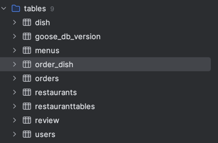
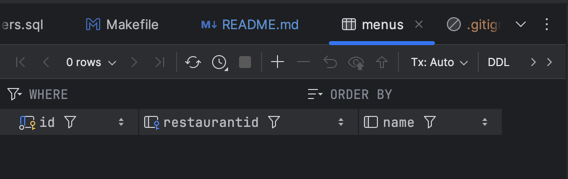
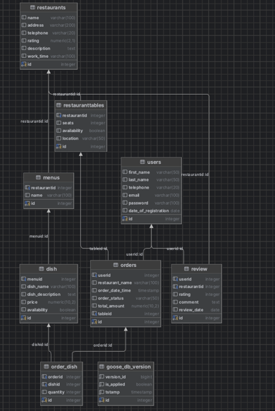

# AllReady
designing a database for the AllReady service

## Usage

```make goose-up``` - for up all migrations

```make goose-down``` - for down all migrations

```make goose-status``` - for look status of migrations


Picture with tables:



And every table was created with all dependencies
For example, table "menus":



## Scheme 



#### To generate data for the fulfillment table 

```make fake-data``` in terminal