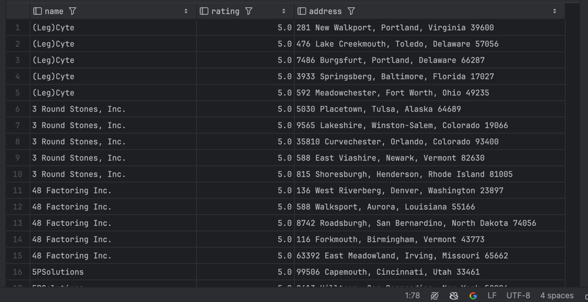

# Easy Level
1.List all restaurants with a rating above 4, sorted by their name

``SELECT name, rating, address 
FROM restaurants 
WHERE rating > 4 
ORDER BY name;``
 

2.Find all available tables with more than 4 seats in a specific restaurant
Restaurant for example - Govini
``SELECT rt.id, rt.seats, rt.location, r.address 
FROM restauranttables rt 
JOIN restaurants r ON rt.restaurantid = r.id 
WHERE rt.availability = true 
  AND rt.seats > 4 
  AND r.name = 'Govini' 
ORDER BY r.address;``
 

3.Get the names and prices of all dishes that are currently available, ordered by price
``SELECT dish_name, price 
FROM dish 
WHERE availability = true 
ORDER BY price DESC;``
 

Explain after dish_price index usage -> 

4.List all users who registered in the last 30 days and have not placed an order yet
``SELECT u.first_name, u.last_name, u.email, u.date_of_registration 
FROM users u 
LEFT JOIN orders o ON u.id = o.userid 
WHERE u.date_of_registration >= CURRENT_DATE - INTERVAL '30 days' 
  AND o.id IS NULL;``
   

# Medium Level
1.Find the top 5 highest-rated restaurants
``SELECT name, rating 
FROM restaurants 
ORDER BY rating DESC 
LIMIT 5;``
 

2.Get the average rating for each restaurant
``SELECT r.name, AVG(rv.rating) as avg_rating 
FROM restaurants r 
JOIN review rv ON r.id = rv.restaurantid 
GROUP BY r.id, r.name;``

  

Explain after adding rest_index -> 

3.List all orders with their associated dishes
``SELECT o.id, o.restaurant_name, d.dish_name, od.quantity 
FROM orders o 
JOIN order_dish od ON o.id = od.orderid 
JOIN dish d ON od.dishid = d.id;``
 

4.Find users who have made more than 4 orders
``SELECT u.first_name, u.last_name, COUNT(o.id) as order_count 
FROM users u 
JOIN orders o ON u.id = o.userid 
GROUP BY u.id, u.first_name, u.last_name 
HAVING COUNT(o.id) > 4;``
 

# Hard Level
1.Find the most popular dish for each restaurant
``WITH dish_counts AS (
    SELECT
        r.id as restaurant_id,
        d.id as dish_id,
        d.dish_name,
        COUNT(*) as order_count,
        ROW_NUMBER() OVER (PARTITION BY r.id ORDER BY COUNT(*) DESC) as rn
    FROM restaurants r
             JOIN menus m ON r.id = m.restaurantid
             JOIN dish d ON m.id = d.menuid
             JOIN order_dish od ON d.id = od.dishid
             JOIN orders o ON od.orderid = o.id
    GROUP BY r.id, d.id, d.dish_name
)
SELECT
    r.name as restaurant_name,
    dc.dish_name,
    dc.order_count
FROM restaurants r
         JOIN dish_counts dc ON r.id = dc.restaurant_id
WHERE dc.rn = 1;``
  

Explain after add dish_index -> 

2.Find the busiest hour for each day of the week, based on order volume
``WITH hourly_orders AS (
  SELECT 
    DATE_TRUNC('hour', order_date_time) AS order_hour,
    EXTRACT(DOW FROM order_date_time) AS day_of_week,
    COUNT(*) AS order_count,
    RANK() OVER (PARTITION BY EXTRACT(DOW FROM order_date_time) 
                 ORDER BY COUNT(*) DESC) AS hour_rank
  FROM orders
  GROUP BY DATE_TRUNC('hour', order_date_time), EXTRACT(DOW FROM order_date_time)
)
SELECT 
  day_of_week,
  TO_CHAR(order_hour, 'HH24:MI') AS busiest_hour,
  order_count
FROM hourly_orders
WHERE hour_rank = 1
ORDER BY day_of_week;``
 

3.Calculate the average order amount and the number of orders for each user, but only for users who have placed orders at restaurants with a rating higher than 4
``SELECT u.id, u.first_name, u.last_name,
       AVG(o.total_amount) AS avg_order_amount,
       COUNT(o.id) AS order_count
FROM users u
         JOIN orders o ON u.id = o.userid
         JOIN restaurants r ON o.restaurant_name = r.name
WHERE r.rating > 4
GROUP BY u.id, u.first_name, u.last_name
HAVING COUNT(o.id) > 0
ORDER BY order_count DESC;``
 

4.Identifying "seasonal" dishes that are ordered significantly more frequently during the year.
``WITH overall_avg AS (
    SELECT restaurantid, AVG(rating) AS avg_rating
    FROM review
    GROUP BY restaurantid
),
     recent_avg AS (
         SELECT restaurantid, AVG(rating) AS avg_rating
         FROM review
         WHERE review_date >= CURRENT_DATE - INTERVAL '1 month'
         GROUP BY restaurantid
     )
SELECT
    r.name,
    o.avg_rating AS overall_average,
    ra.avg_rating AS recent_average,
    (ra.avg_rating - o.avg_rating) AS rating_improvement
FROM restaurants r
         JOIN overall_avg o ON r.id = o.restaurantid
         JOIN recent_avg ra ON r.id = ra.restaurantid
WHERE ra.avg_rating > o.avg_rating * 1.2
ORDER BY rating_improvement DESC;``
 